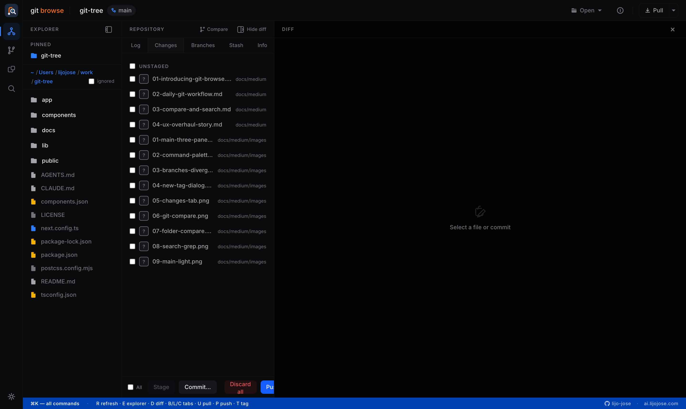

# Changes

The Changes tab shows your working tree — modified, added, and deleted files — and lets you stage, commit, and push.

---

## Viewing diffs

Click any file in the Changes tab to see its diff in the right panel. The diff shows unstaged changes by default. Staged files show what will be included in the next commit.

Toggle between **unified** and **split** view using the buttons at the top of the diff panel. Enable **Wrap** for long lines.

---

## Staging files

- **Stage a single file** — click the checkbox next to the file, or click the `+` icon
- **Stage all files** — click **Stage all** at the top of the list
- **Unstage** — click the checkbox again on a staged file

---

## Committing

1. Stage the files you want to include
2. Type a commit message in the input at the bottom of the Changes tab
3. Click **Commit**

After committing, the Sync button in the top bar will show `↑1` — your cue to push when ready.

---

## Discarding changes

Right-click any unstaged file and choose **Discard changes** to revert it to the last committed state. A confirmation dialog shows exactly what will be discarded.

---

## Patch import / export

The **Patch** menu at the top of the Changes tab lets you move changes around as `.patch` files — handy for sharing a fix, backing up work-in-progress, or applying a patch someone sent you.

- **Download all changes** — exports your entire working-tree diff to `changes.patch`.
- **Download selected (N)** — exports only the files you've checked to `selected.patch`.
- **Import patch…** — pick a `.patch` file and Git Browse applies it to the working tree (`git apply`). A toast confirms success or explains why it didn't apply cleanly.

Exported patches are standard `git` patches, so they apply with `git apply` on any machine — not just Git Browse.

---

## Push

After committing, click the **Pull** button's caret (▾) and choose **Push**, or press `P`. Pushing is guarded by the [danger zone](settings.md#security--danger-zone), so the first push shows a confirmation dialog unless you've unlocked the Push operation.

**Selective remote push** — if the repo has more than one remote, a picker opens listing every remote with its push URL. Tick the remote(s) you want and Git Browse pushes to each in turn. With a single remote it pushes straight there.

If your branch has no upstream set yet, Git Browse shows a dialog with the exact `git push --set-upstream <remote> <branch>` command it will run, and asks you to confirm. Git Browse no longer assumes a remote named `origin` — it picks the target in this order: the branch's existing upstream remote, then `remote.pushDefault`, then `origin`, and finally your first configured remote. If the repo has no remotes at all, it tells you to add one first.

---

## Keyboard shortcuts

| Key | Action |
|---|---|
| `C` | Switch to Changes tab |
| `P` | Push to remote |
| `U` | Pull from remote |

---

[← Back to index](README.md)
