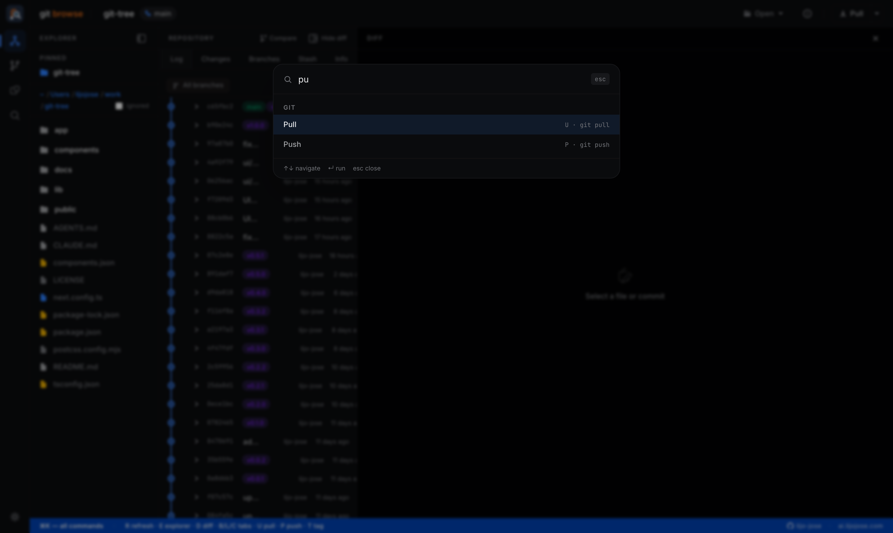

# Keyboard Shortcuts

Press `⌘K` (Mac) or `Ctrl+K` (Windows/Linux) anywhere to open the **command palette** — a searchable list of every action with its shortcut displayed inline.

---

## Global shortcuts

These work on any page.

| Key | Action |
|---|---|
| `⌘K` / `Ctrl+K` | Open command palette |
| `E` | Toggle Explorer sidebar |
| `D` | Toggle Diff panel |
| `R` | Refresh current repository |

---

## Navigation

| Key | Action |
|---|---|
| `L` | Switch to Log tab |
| `C` | Switch to Changes tab |
| `B` | Switch to Branches tab |

---

## Git operations

These require a repository to be open.

| Key | Action |
|---|---|
| `U` | Pull from remote (`git pull`) |
| `P` | Push to remote (`git push`) |
| `T` | Create a new tag |

---

## Diff panel

| Control | Action |
|---|---|
| **Unified / Split** toggle | Switch diff layout |
| **Wrap** toggle | Wrap long lines |
| **All** / file tabs | Switch between files in a multi-file diff |

---

## Tips

- All shortcuts ignore modifier keys — `⌘L`, `Ctrl+L`, `Alt+L` etc. are reserved for the browser. Use plain `L`.
- If a shortcut does nothing, check that focus is not inside a text input.
- The command palette (`⌘K`) is the fastest way to discover actions — type any keyword and the matching command appears with its shortcut.

---

[← Back to index](README.md)
