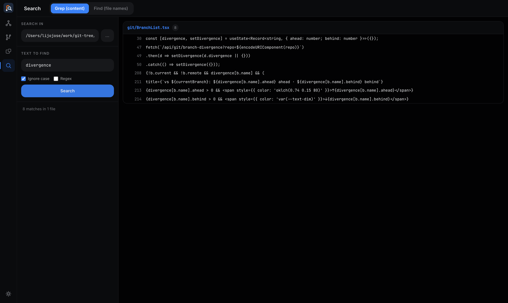

# Search

The Search page wraps grep and find with a simple UI. Click the **Search** icon (magnifying glass) in the activity rail.

---

## Grep — search file contents

Search for text inside files in any directory.

1. Set the **Search in** folder (defaults to the current repo)
2. Enter your search term
3. Choose options:
   - **Ignore case** — case-insensitive match
   - **Regex** — treat the search term as a regular expression
4. Click **Search**

Results are grouped by file, showing line numbers and the matching line for each hit. The result count per file is shown next to the filename.

Recent searches are saved and shown below the form for quick re-use.

---

## Find — search file names

Switch to the **Find (file names)** tab to locate files by name or glob pattern.

Examples:
- `config*` — any file starting with "config"
- `*.ts` — all TypeScript files
- `Dockerfile` — exact filename match

Results show full paths. Click any result to open the file.

---

## Notes

- Search runs server-side against your local filesystem — it's fast and works on any folder, not just git repos
- Results are truncated at a limit and will tell you when they are
- The folder picker doubles as a mini file browser if you need to navigate to a subfolder

---

[← Back to index](README.md)
