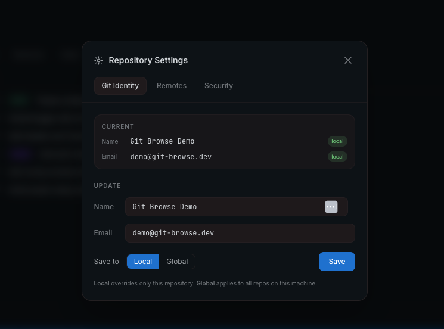
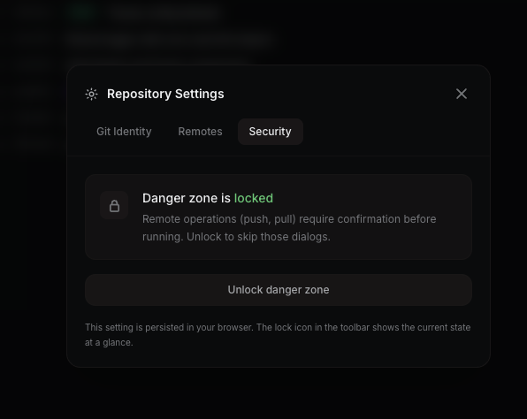

# Repository Settings

Repository Settings lets you manage git identity, remotes, and security options for the current repo.

**To open:** Click the **Info** tab in the Repository panel → click the settings (⚙) icon, or use ⌘K → "Repository settings".

---

## Git Identity

View and update the `user.name` and `user.email` used for commits.

The **Current** section shows the values currently in effect and where they come from — **local** (this repo only) or **global** (all repos on this machine).

**To update:**
1. Edit the Name and Email fields
2. Choose scope: **Local** (overrides just this repo) or **Global** (applies machine-wide)
3. Click **Save**

Use local scope when you need a different identity for a specific repo (e.g. a work repo where you want your work email).

---

## Remotes

View, add, edit, and remove git remotes for the current repository.

Each remote shows its fetch and push URLs. Actions available:

- **Edit** — update the remote URL in place
- **Remove** — delete the remote (two-step confirm)
- **Add remote** — add a new remote with a name and URL

When a repo has **more than one remote**, pushing opens a picker so you can choose exactly which remote(s) to push to — see [Selective remote push](changes.md#push) in the Changes guide. Git Browse no longer assumes a remote named `origin`; when it has to pick a default it prefers the branch's upstream remote, then `remote.pushDefault`, then `origin`, then your first remote.

---

## Security — Danger Zone

The danger zone guards potentially destructive git operations behind a confirmation dialog. Unlocking is **per operation** — confirming (or always-allowing) one operation does not unlock the others.

Guarded operations:

| Operation | What it covers |
|---|---|
| **Push** | `git push`, including push-and-set-upstream |
| **Pull** | `git pull` (may create merge commits or conflicts) |
| **Create & push tag** | Tagging HEAD and pushing the tag to the remote |
| **Rebase** | Rebase onto another branch and interactive rebase (rewrites history) |

### How a guarded operation behaves

When an operation is **locked** (the default), triggering it opens a confirmation dialog describing what it does. You then choose:

- **Proceed once** — run it this one time; the operation stays locked.
- **Always allow** — run it now and unlock this operation so future runs skip the dialog.
- **Cancel** — do nothing.

When an operation is **unlocked**, it runs immediately on the first click.

### The lock toggle in the top bar

The lock icon in the top bar reflects whether **any** operation is currently unlocked. Clicking it is a bulk switch:

- If everything is locked, it **unlocks all** guarded operations.
- If anything is unlocked, it **locks all** of them again.

**When to unlock:** During a release session or heavy rebase work where you're running many syncs in sequence and confirmation dialogs are just noise.

**When to keep locked:** On shared branches where a mistaken push or history rewrite has real consequences.

Unlock state is persisted in your browser's local storage, per machine — it survives reloads and is remembered the next time you open Git Browse.

---

[← Back to index](README.md)
